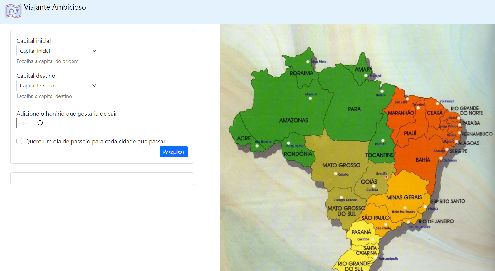
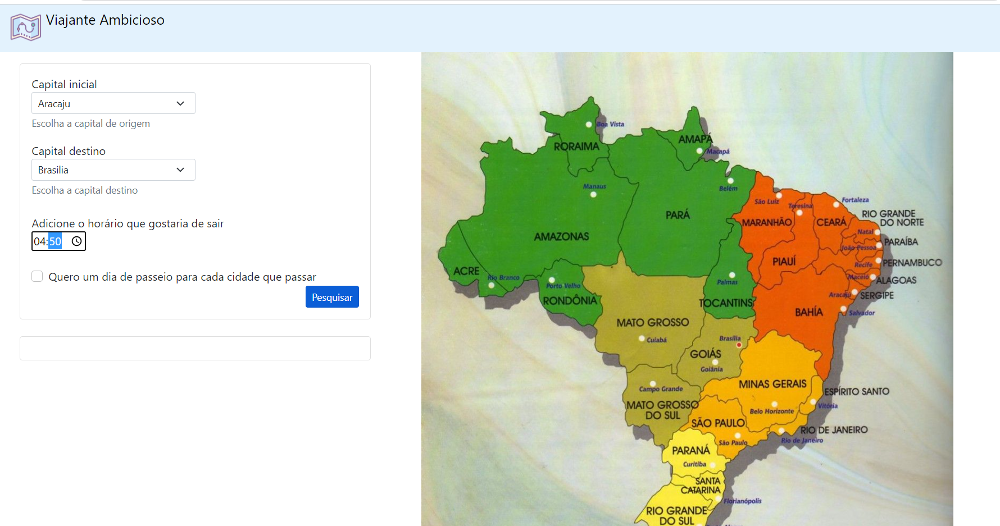
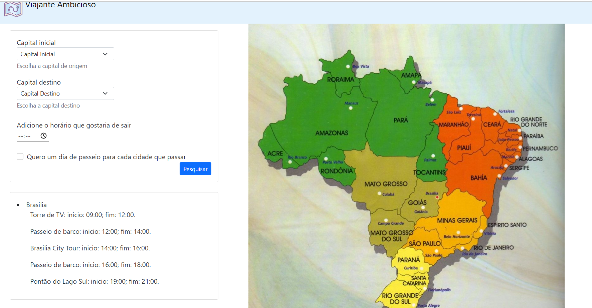

# Viajante Ambicioso

**Número da Lista**: 8 
**Conteúdo da Disciplina**: Final 

## Alunos
|Matrícula | Aluno |
| -- | -- |
| 19/0025298 |  Bianca Sofia Brasil de Oliveira |
| 19/0026375  |  Daniel Vinicius Ribeiro Alves |

## Sobre 
O viajante tem como objetivo acompanhar toda a trajetória de um viajante, sendo que ele encontra o menor caminho entre duas capitais passando por diversas outras capitais usando algoritmos de grafos. Além disso, ele monta uma grade de passeios para o viajante poder se divertir bastante usando interval scheduling.

## Screenshots
Screenshots do projeto
	
	
	

## Instalação 
**Linguagem**: Javascript 
Para rodar o projeto localmente, é necessário possuir o node instalado na máquina
Clone o repositório em sua máquina local e baixe as dependências com npm install.
Para executar o projeto: node app.js.
O projeto roda na porta: localhost:3000

## Uso 
Deve-se escolher uma capital de inicio e uma de destino, em seguida escolher se deseja a grade de passeios em todas as capitais percorridas ou somente na última.

